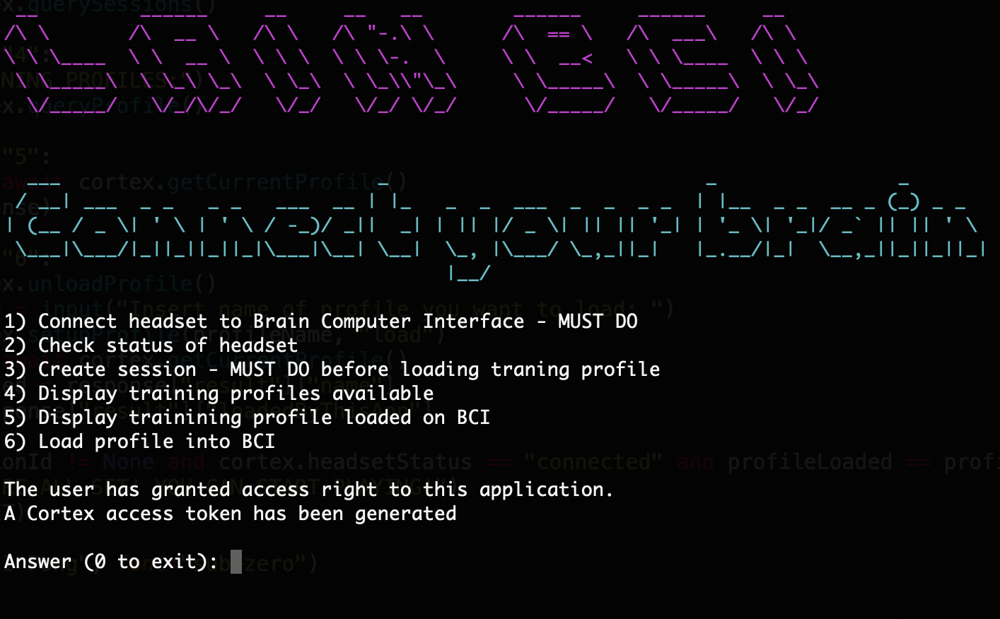
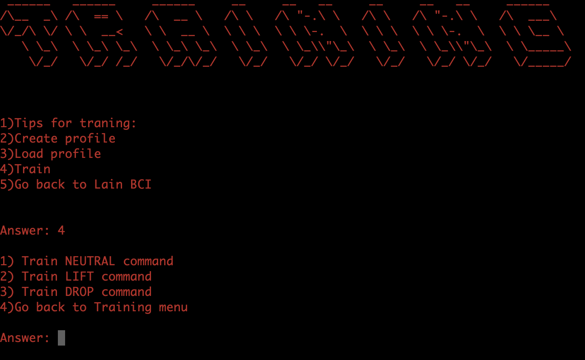
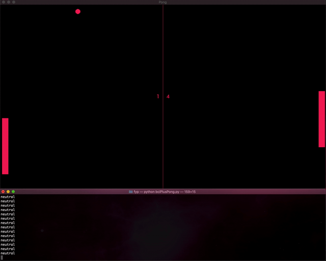
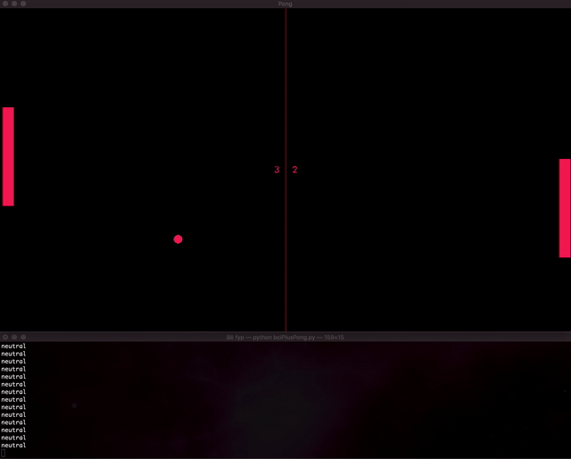

# EEG-based-Brain-Computer-Interface-to-play-Pong
Developed Electroencephalography(EEG) Brain Computer Interface to play Pong using brain activity.
The program allows to play Pong using brain activity. Furthermore, when the player hits the ball 2 times is a row they unlock a powerup. The powerup works only if the player reaches a high level of focus.

Requirements:
- EEG Emotiv Epoc+ headset
- PyGame
- websockets
- Colorama
- Art

BCI system was developed using Python and Emotiv Cortex API to receive data from the EEG headset. Pong was developed using PyGame. The BCI uses mental commands to control the paddle movements (UP or DOWN). Mental commands are thoughts associated to a specific command. The Emotiv proprietary algorithm classifies the patterns in brain activity produced when the user is recreating the chosen thoughts. It is necessary to train the commands before using them. Mental commands are retrieved using the Emotiv Cortex API.

To measure brain waves I used the Emotiv Epoc+ headset. It has 14 electrodes 

In addition I developed an asynchronous library called Cortex to communicate with the Cortex API. The libary acts as a Python wrapper for all the available methods in the API and streams sensor data. It generates JSON requests and receives JSON responses through a socket. The library can be used by anyone who wants to develop a BCI in Python using Cortex API. Feel free to make changes to it.

<b> How it works </b>
1) Headset measures brain waves (eletricity generated by neurons)
2) Emotiv process and classifies the signals with proprietary algorithms
3) Use Cortex library to request mental commands from Cortex API
4) Use mental commands to move the paddle up or down
5) Visual feedback.

I also developed Lain BCI which allows to connect the headset to the game, create session, load training profile and train commands. 

                                                     
Here is the training menu.  

                                                      
<b> DEMO </b> 
 

